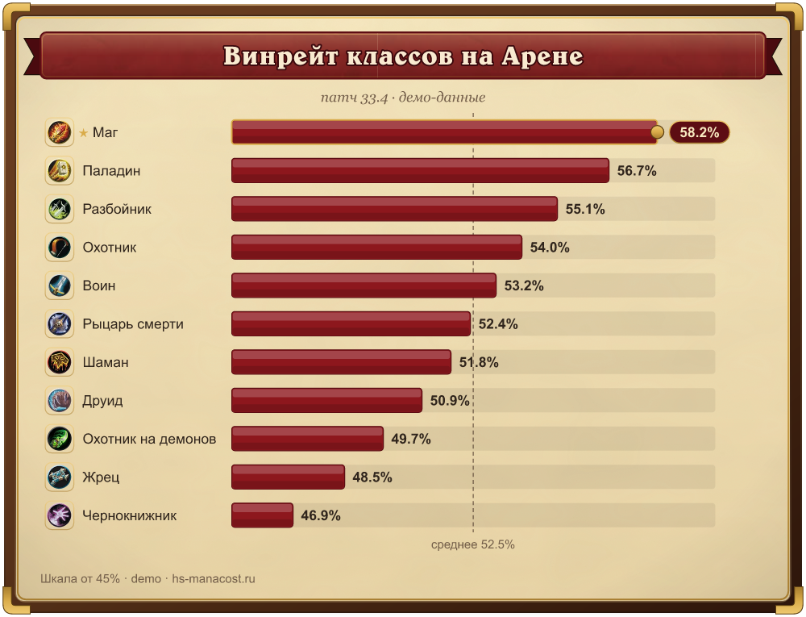
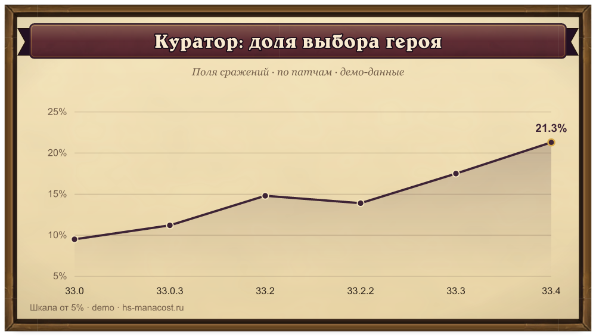
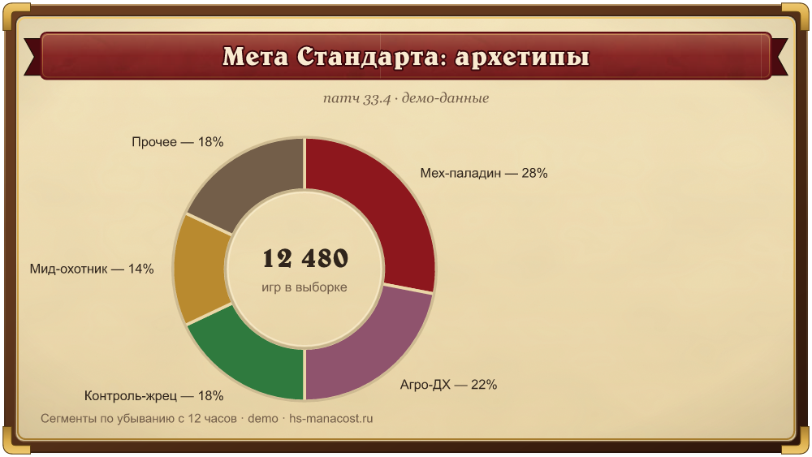
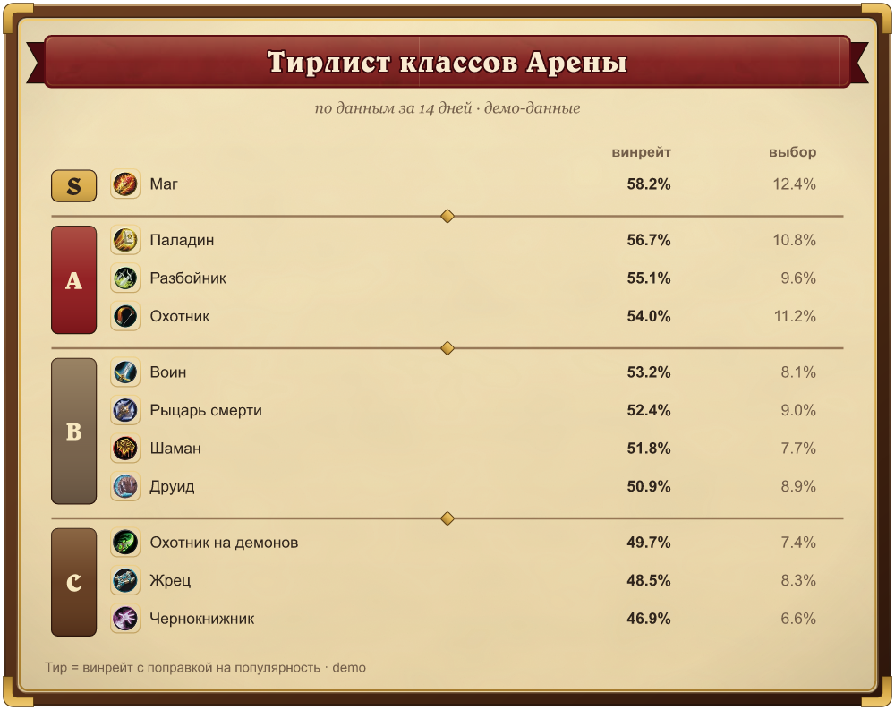
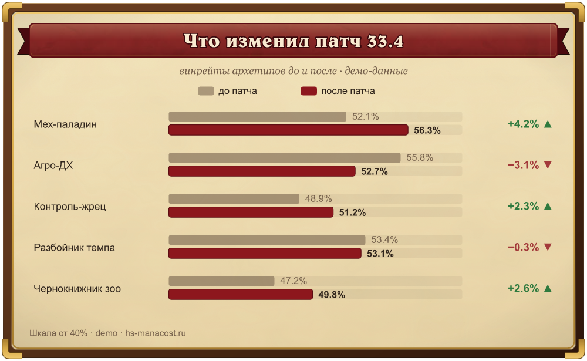
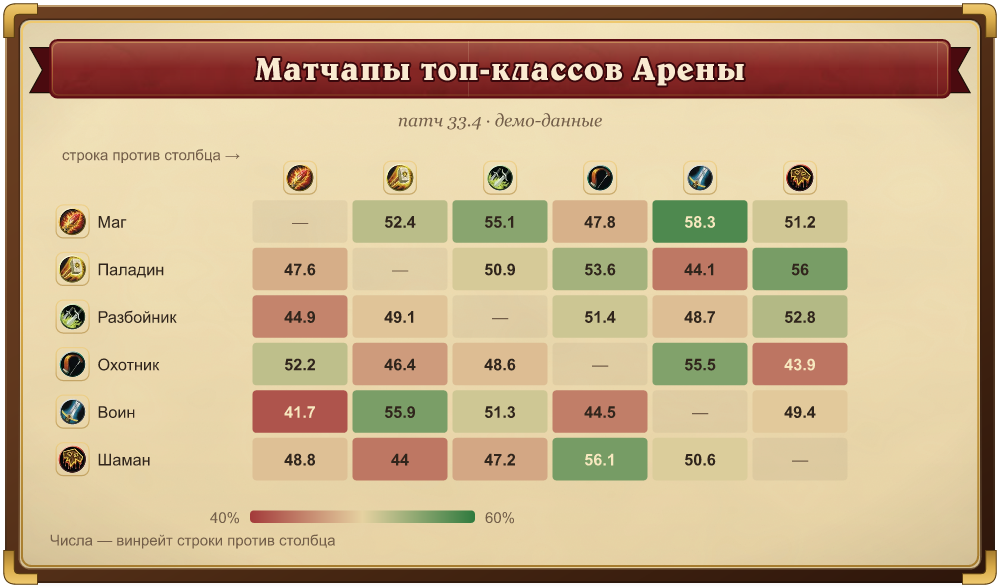
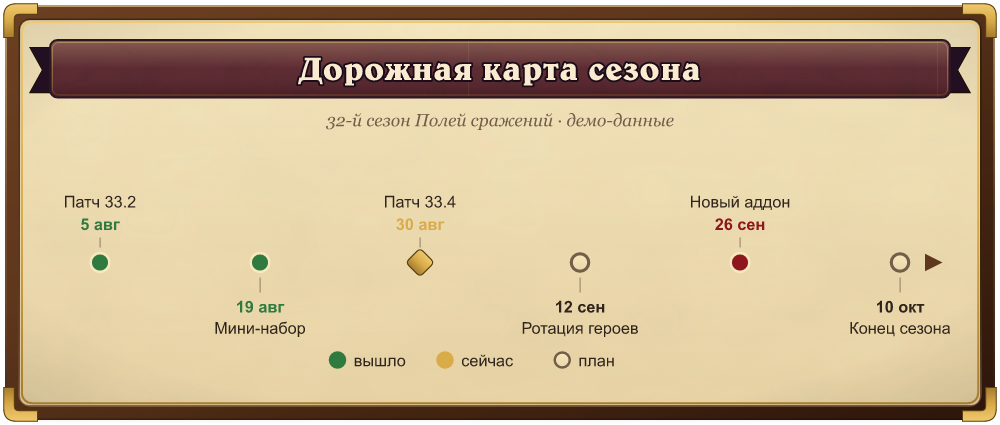
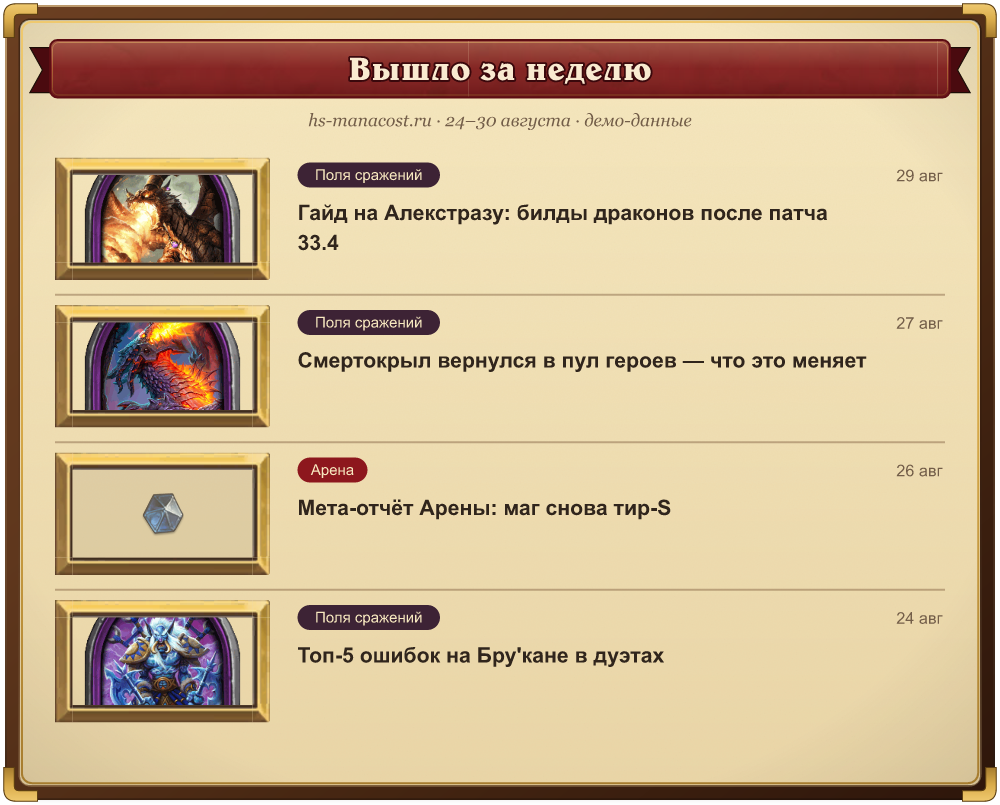
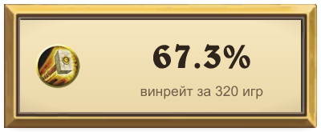

# SVGTeam · Hearthstone SVG Charts

Скилл для [Claude Code](https://claude.com/claude-code), который генерирует SVG-графики и инфографику в стиле Hearthstone — пергамент, деревянная рамка, родной шрифт игры — с **прозрачным фоном** вокруг рамки. Графики выглядят как предметы из таверны, лежащие на странице статьи, и работают на любом фоне сайта.



Дизайн следует системе [HS-Arena / HeartPulse](https://github.com/Manacost-Labs/HeartPulse): палитра, типографика и ассеты — те же, что на [arena.hs-manacost.ru](https://arena.hs-manacost.ru).

## Шаблоны

9 типов, каждый генерируется из JSON-спека одной командой. Все спеки лежат в [`hearthstone-svg-charts/examples/specs/`](hearthstone-svg-charts/examples/specs/), готовые SVG — в [`examples/`](hearthstone-svg-charts/examples/).

| | |
|---|---|
| **`bars`** — винрейты и популярность, иконки классов, медальон лидера  | **`line`** — динамика по патчам, рамка из ассетов игры  |
| **`donut`** — доли архетипов/редкостей, итог в центре  | **`tierlist`** — группы S/A/B/C с плашками и колонками  |
| **`beforeafter`** — что изменил патч, дельты ▲/▼  | **`matchup`** — матрица «кто кого контрит» с дивергентной раскраской  |
| **`timeline`** — история событий и дорожные карты сезона  | **`digest`** — «вышло за неделю»: обложки статей в золотых рамках  |
| **`badge`** — стат-врезка для лида статьи или соцсетей  | |

## Что внутри дизайна

- **Шрифт Belwe** (родной шрифт Hearthstone, с кириллицей) — сабсет вшивается прямо в SVG через `@font-face` с data-URI, поэтому работает даже при вставке через `` без сети;
- заголовок — **лента красного сукна таверны** с ласточкиными хвостами (настоящая текстура из игры, 3 КБ);
- рамка с бевелами под единый источник света, золотыми уголками и мягкой тенью;
- пергамент с зерном, пятнами выцветания и прижжёнными краями;
- игровые ассеты data-URI: 11 иконок классов, 12 типов существ, тир-бейджи таверны 1–7, гемы редкости, портреты героев Полей сражений (по требованию);
- **никаких внешних ссылок внутри SVG** — всё вектор или data-URI, файл самодостаточен;
- два уровня отделки: `parade` для полноразмерных графиков, `quiet` для врезок.

## Установка

```bash
git clone https://github.com/Manacost-Labs/SVGTeam.git
ln -s "$(pwd)/SVGTeam/hearthstone-svg-charts" ~/.claude/skills/hearthstone-svg-charts
cd SVGTeam/hearthstone-svg-charts
python3 scripts/fetch_assets.py                      # игровые ассеты (~40 файлов)
python3 -m pip install --user fonttools brotli       # вшивание шрифта (опционально, но стоит)
brew install resvg                                   # PNG-экспорт (опционально)
```

После этого в Claude Code достаточно попросить: *«сделай график винрейтов классов для статьи»* — скилл сработает сам.

## Использование без Claude

Генератор — обычный Python-скрипт, никаких зависимостей кроме стандартной библиотеки (fonttools — опционально):

```bash
python3 scripts/make_chart.py spec.json -o chart.svg   # SVG из JSON-спека
python3 scripts/validate.py chart.svg                  # статические проверки
python3 scripts/export_png.py chart.svg                # PNG 2x для соцсетей
```

Минимальный спек:

```json
{
  "type": "bars",
  "title": "Винрейт классов на Арене",
  "subtitle": "патч 33.4",
  "theme": "arena",
  "data": [
    {"label": "Маг", "icon": "mage", "value": 58.2},
    {"label": "Паладин", "icon": "paladin", "value": 56.7}
  ]
}
```

Полное описание всех спеков — в [`references/generator.md`](hearthstone-svg-charts/references/generator.md).

## Структура

```
hearthstone-svg-charts/
├── SKILL.md                 # workflow скилла для Claude
├── references/              # дизайн-токены, рамки, шаблоны, спеки генератора
├── scripts/
│   ├── make_chart.py        # JSON → SVG, все 9 типов
│   ├── fetch_assets.py      # загрузка игровых ассетов (+ --bg-hero "Имя")
│   ├── export_png.py        # SVG → PNG через resvg
│   ├── validate.py          # проверки прозрачности/масштаба/ссылок
│   ├── checkerboard.py      # превью на шахматке для визуальной проверки
│   └── frame9.py            # 9-slice рамки из игровых PNG
├── assets/                  # текстуры, иконки, шрифт (data-URI версии в datauri/)
└── examples/                # эталонные SVG + JSON-спеки всех типов
```

## Права

Hearthstone® и игровые изображения принадлежат Blizzard Entertainment. Ассеты используются в некоммерческом фан-проекте; перед иным использованием проверьте права.
